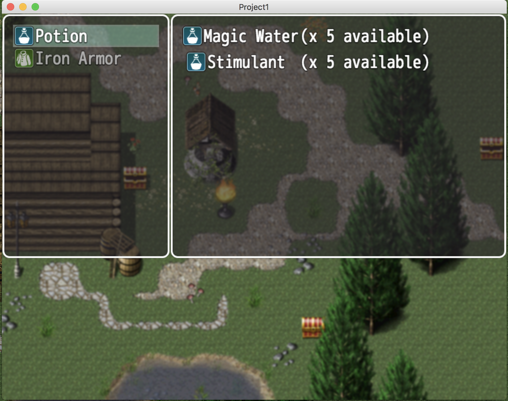

# rpg_maker_mv_js
Collection of javascript plugins for the game engine RPG Maker MV

# Crafting System
(In Progress)

Allows for crafting items if user has the neccessary ingredients

# Character Movements
(Finalized)

Allows the use of different character sheets for different movement types: Idle, Walk and Run

Video / Demonstration: https://www.youtube.com/watch?v=0_ymbxorNz0
